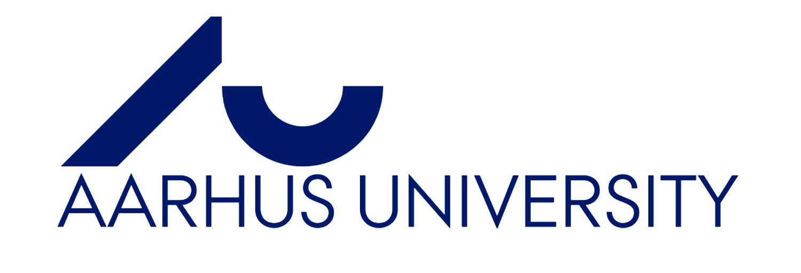

<!-- PROJECT LOGO -->
<br />
<p align="center">
  <a href="https://github.com/JohanHorsmans/cds-language-exam-2021">
    
  </a>
  
  <h1 align="center">Cultural Data Science 2021</h1> 
  <h3 align="center">Language Analytics Exam</h3> 


  <p align="center">
    Johan Kresten Horsmans
    <br />
    <a href="https://github.com/JohanHorsmans/cds-language-exam-2021.pdf"><strong>Link to portfolio descriptions »</strong></a>
    <br />
  </p>
</p>


<!-- TABLE OF CONTENTS -->
<details open="open">
  <summary>Table of Contents</summary>
  <ol>
    <li><a href="#project-info">Project info</a></li>
    <li><a href="#setting-up-virtual-environment-and-downloading-data">Setting up virtual environment and downloading data</a></li>
    <li><a href="#repository-structure-and-contents">Repository structure and contents</a></li>
    <li>
      <a href="#portfolio-assignments">Portfolio assignments</a>
      <ul>
        <li><a href="#assignment-2---string-processing-with-python">Assignment 2 - String Processing With Python</a></li>
        <li><a href="#assignment-3---sentiment-analysis">Assignment 3 - Sentiment Analysis</a></li>
        <li><a href="#assignment-5---(un)supervised-machine-learning">Assignment 5 - (Un)supervised Machine Learning</a></li>
        <li><a href="#assignment-6---text-classification-using-deep-learning">Assignment 6 - Text classification using Deep Learning</a></li>
        <li><a href="#self-assigned-project---danish-hate-speech-detection">Self-assigned project - Danish hate speech detection</a></li>
      </ul>
    </li>
    <li><a href="#license">License</a></li>
    <li><a href="#acknowledgements">Acknowledgements</a></li>
    <li><a href="#contact">Contact</a></li>
  </ol>
</details>


<!-- PROJECT INFO -->
## Project info

This repository houses the exam of _Johan Kresten Horsmans (AU ID: au618771)_ for the course [_Language Analytics_](https://kursuskatalog.au.dk/en/course/101990/Language-Analytics), as part of the bachelor's elective [_Cultural Data Science_](https://bachelor.au.dk/en/supplementary-subject/culturaldatascience/) at Aarhus University. The repository consists of 4 assignments: three class assignments and one self-assigned project. The following README details how to run the code and contains a thorough explanation of how the repository is structured.

The assignments included in this portfolio are the following:
* Assignment 2 - _String Processing With Python_
* Assignment 3 - _Sentiment Analysis_
* Assignment 5 - _(Un)supervised Machine Learning_
* Assignment 6 - _Text classification using Deep Learning_
* Self-assigned project - _Danish hate speech detection_

<!-- HOW TO RUN -->
## Setting Up Virtual Environment And Downloading Prerequisites

To run the assignments, you need to go through the following steps in your bash-terminal to configure- and activate a virtual environment and download the prerequisites needed to run the code:

__NOTE:__ The code and scripts below will only work for Linux, OS X and Worker02:

```bash
cd {directory where you want the assignment saved}
git clone https://github.com/JohanHorsmans/cds-language-exam-2021.git
cd cds-language-exam-2021
bash create_lang_venv.sh
source lang_venv/bin/activate
```
If you wish to uninstall the virtual environment after running the code, you need to run the following in your bash-terminal:

```bash
cd {cds-language-exam-2021}
bash delete_lang_venv.sh
```

<!-- REPOSITORY STRUCTURE AND CONTENTS -->
## Repository structure and contents

__NOTE:__ Throughout the repository's README-files (including this one), the repository structure is described as it appears before downloading the
additional data specified in the bash-script above.

This repository contains the following folders:

|Folder|Description|
|:--------|:-----------|
```README_images/```| Folder containing the images in the README-files
```assignment_.*/``` | Folders containing code, data and usage-instructions for the four assignments
```self_assigned/``` | Folder containing code, data and usage-instructions for the self-assigned project
```utils/``` | Folder containing functions written by our teacher, [Ross Deans Kristensen-McLachlan](https://pure.au.dk/portal/en/persons/ross-deans-kristensenmclachlan(29ad140e-0785-4e07-bdc1-8af12f15856c).html), which are employed in some of the assignments.

Furthermore, it holds the following files:
|File|Description|
|:--------|:-----------|
```create_lang_venv.sh``` | A bash script that generates a new virtual environment called "lang_venv" with all the packages specified in the ```requirements.txt```-file.
```data_download.sh``` | A bash-script that automatically downloads all data and creates the necessary folder structure that is needed to run the assignments.
```requirements.txt``` | A txt-file containing a list of the packages (and versions) that are needed for the virtual environment.
```README.md``` | The README file that you are currently reading.

<!-- PORTFOLIO ASSIGNMENTS -->
## Portfolio assignments

### Assignment 2 - String Processing With Python

Go through the following steps to run assignment 2:
```bash
cd {root directory (i.e. cds-lang-exam-2021)}
cd assignment_2
python3 collocation.py
```
Type: ```python3 edge_detection.py -h``` for a detailed guide on how to specify script-parameters. 

For more information, see [```assignment_2/README.md```](https://github.com/JohanHorsmans/cds-visual-exam-2021/tree/main/assignment_3)

### Assignment 3 - Sentiment Analysis

Go through the following steps to run assignment 3:
```bash
cd {root directory (i.e. cds-lang-exam-2021)}
cd assignment_3
python3 sentiment.py
```
Type: ```python3 edge_detection.py -h``` for a detailed guide on how to specify script-parameters. 

For more information, see [```assignment_3/README.md```](https://github.com/JohanHorsmans/cds-visual-exam-2021/tree/main/assignment_3)

### Assignment 5 - (Un)supervised Machine Learning

Go through the following steps to run assignment 5:
```bash
cd {root directory (i.e. cds-lang-exam-2021)}
cd assignment_5
python3 HateClass.py
```
Type: ```python3 cnn-artists.py -h``` for a detailed guide on how to specify script-parameters. 

For more information, see [```assignment_5/README.md```](https://github.com/JohanHorsmans/cds-visual-exam-2021/tree/main/assignment_5)

### Assignment 6 - Text classification using Deep Learning

Go through the following steps to run assignment 6:
```bash
cd {root directory (i.e. cds-lang-exam-2021)}
cd assignment_6
python3 GoT-lr.py
python3 GoT-dl.py
```
Type: ```python3 GoT-dl.py -h``` for a detailed guide on how to specify script-parameters. 

For more information, see [```assignment_6/README.md```](https://github.com/JohanHorsmans/cds-visual-exam-2021/tree/main/assignment_4)

### Self-assigned project - Danish hate speech detection

To run the self-assigned assignment, go the the "self_assigned.ipynb"-notebook in the "self_assigned"-folder.

For more information, see [```self_assigned/README.md```](https://github.com/JohanHorsmans/cds-visual-exam-2021/tree/main/self_assigned)

<!-- LICENSE -->
## License
Distributed under the [Apache License 2.0](https://www.apache.org/licenses/LICENSE-2.0). See ```LICENSE``` for more information.

<!-- ACKNOWLEDGEMENTS -->
## Acknowledgements
* [Ross Dean McLachlan](https://pure.au.dk/portal/en/persons/ross-deans-kristensenmclachlan(29ad140e-0785-4e07-bdc1-8af12f15856c).html) - Our teacher for the Language Analytics course
* [Emil Jessen](https://github.com/emiltj) - With whom I have collaborated in creating this README structure and brainstormed ideas for the self-assigned project.
* [Gustav Aarup Lauridsen](https://github.com/Guscode) - My partner for assignment 5 and the self-assigned project.


<!-- CONTACT -->
## Contact

By all means contact me, Johan Horsmans, for any questions regarding the repository/assignments. You can reach out to me on my e-mail horsmans1004@gmail.com or on social media:

[][twitter]
[][facebook]
<br />

</details>

[twitter]: https://twitter.com/JohanHorsmans
[facebook]: https://www.facebook.com/johan.horsmans/

<br />
<p align="center">
  <a href="https://github.com/JohanHorsmans/cds-visual-exam-2021">
    
  </a>
