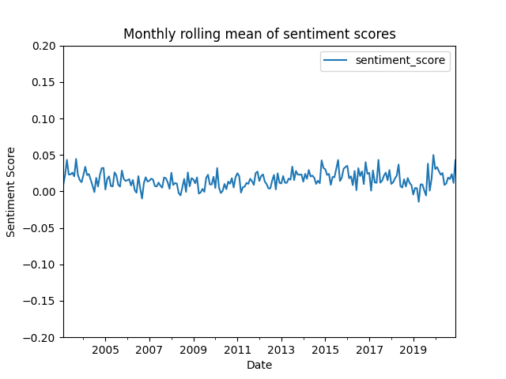

<!-- PROJECT LOGO -->
<br />
<p align="center">
  <a href="https://github.com/JohanHorsmans/cds-language-exam-2021">
    
  </a>
  
  <h1 align="center">Cultural Data Science 2021</h1> 
  <h3 align="center">Assignment 3</h3> 

  <p align="center">
    Johan Kresten Horsmans
    <br />
    <a href="https://github.com/JohanHorsmans/cds-visual-exam-2021/blob/main/Language_Analytics_Exam.pdf"><strong>Link to PDF with all portfolio descriptions »</strong></a>
    <br />
  </p>
</p>

<!-- TABLE OF CONTENTS -->
<details open="open">
  <summary>Table of Contents</summary>
  <ol>
    <li><a href="#official-description-from-instructor">Official description from instructor</a></li>
    <li><a href="#methods">Methods</a></li>
    <li><a href="#how-to-run">How to run</a></li>
    <li><a href="#repository-structure-and-contents">Repository structure and contents</a></li>
    <li><a href="#discussion-of-results">Discussion of results</a></li>
  </ol>
</details>

<!-- OFFICIAL DESCRIPTION FROM INSTRUCTOR -->
## Official description from instructor

### Dictionary-based sentiment analysis with Python

This is a dataset of over a million headlines taken from the Australian news source ABC (Start Date: **2003-02-19** ; End Date: **2020-12-31**).

* Calculate the sentiment score for every headline in the data. You can do this using the spaCyTextBlob approach that we covered in class or any other dictionary-based approach in Python.
* Create and save a plot of sentiment over time with a 1-week rolling average
* Create and save a plot of sentiment over time with a 1-month rolling average
* Make sure that you have clear values on the x-axis and that you include the following: a plot title; labels for the x and y axes; and a legend for the plot
* Write a short summary (no more than a paragraph) describing what the two plots show. You should mention the following points: 1) What (if any) are the general trends? 2) What (if any) inferences might you draw from them?

* __HINT:__ You'll probably want to calculate an average score for each day first, before calculating the rolling averages for weeks and months.

__General instructions__

* For this assignment, you should upload a standalone .py script which can be executed from the command line or a Jupyter Notebook
* Save your script as sentiment.py or sentiment.ipynb
* Make sure to include a requirements.txt file and details about where to find the data
* You can either upload the scripts here or push to GitHub and include a link - or both!
* Your code should be clearly documented in a way that allows others to easily follow the structure of your script and to use them from the command line

__Purpose__
This assignment is designed to test that you have a understanding of:

* how to perform dictionary-based sentiment analysis in Python;
* how to effectively use pandas and spaCy in a simple NLP workflow;
* how to present results visually, working with datetime formats to show trends over time

<!-- METHODS -->
## Methods

The problem of this assignment relates to mangling and processing date-time-data and calculating rolling sentiment scores for a large text corpus. I used pandas to convert the data to date-time format and arrange the headlines in chronological order. To reduce run-time, I carried out the analysis on a subset of 100.000 randomly sampled headlines. I used SpaCy text blob to calculate the sentiment-score for the headlines. After this, I batched the data together with a batch-size of 500 to make the analysis run faster. I then calculated mean sentiment score for each week and month and plotted the scores in two separate graphs (see _discussion of results_). Lastly, I also made the script write a csv-file named _"sentiment.csv"_ with the score for each individual headline.

<!-- HOW TO RUN -->
## How to run

__NOTICE:__ To run the assignment, you need to have configured and activated your virtual environment. See the main [README](https://github.com/JohanHorsmans/cds-language-exam-2021/blob/main/README.md) for a guide on how to do this.

Go through the following steps to run assignment 3:
```bash
cd {root directory (i.e. cds-language-exam-2021)}
cd assignment_3
python3 sentiment.py
```
<!-- REPOSITORY STRUCTURE AND CONTENTS -->
## Repository structure and contents

This repository contains the following folder:

|Folder|Description|
|:--------|:-----------|
```data/``` | Folder containing a dataset consisting over a million headlines taken from the Australian news source ABC (Start Date: **2003-02-19** ; End Date: **2020-12-31**)

Furthermore, it holds the following files:
|File|Description|
|:--------|:-----------|
```sentiment.py``` | The python script for the assignment.
```README.md``` | The README file that you are currently reading.

<!-- DISCUSSION OF RESULTS -->
## Discussion of results

Two plots are produced by the script. One for the weekly rolling sentiment score (_figure 1_) and one for the monthly rolling sentiment score (_figure 2_). The two plots show that the news data is generally slightly positive (Sentiment score > 0) in spite of the fluctuations on a weekly/monthly basis. We see that the variance in sentiment score is larger on a weekly basis than on a monthly basis, indicating that the variance seen from week to week is quite similar in both directions and thus, to a certain extent, cancel each other out when analysed on a monthly basis. I have limited the y-axis of the plot to go from -0.2 to 0.2 (the full scale goes from -1 to 1) which underlines that the  fluctuations seen in the plots are very small. I argue that it is a good indicator of journalistic objectivity that the sentiment score of the headlines are very close to zero with small fluctuations appearing to be mostly even in both directions when viewed on a monthly scale. 


<br />
<p align="center">
  <a href="https://github.com/JohanHorsmans/cds-visual-exam-2021">
    
  </a>
  
<p align="center">
Figure 1: Weekly sentiment score
  
<p align="center">
  <a href="https://github.com/JohanHorsmans/cds-visual-exam-2021">
    
  </a>

<p align="center">
Figure 2: Monthly sentiment score


<br />
<p align="center">
  <a href="https://github.com/JohanHorsmans/cds-visual-exam-2021">
    
  </a>
